# awesome-MemoryNetwork
记忆神经网络有关的工作

对于记忆神经网络而言，memory slot里面的信息如果对于query是很有用的将会变得很好。
抽取信息的时候如果有两种memory@embedding，那么一个是和query更加相关的，一个是和答案相关的结果会比单纯两个memory效果要更好。

该两个亮点的idea全部来自于KVMemN2N

## 1.最初始的记忆神经网络(非end-to-end)2014FB


IGOR四个模块～
简单来说，就是输入的文本经过Input模块编码成向量，然后将其作为Generalization模块的输入，该模块根据输入的向量对memory进行读写操作，即对记忆进行更新。然后Output模块会根据Question（也会进过Input模块进行编码）对memory的内容进行权重处理，将记忆按照与Question的相关程度进行组合得到输出向量，最终Response模块根据输出向量编码生成一个自然语言的答案出来。
#### 整个流程
```
整个流程是这样的。首先就是input和generalization模块做的工作都很简单，一个是输入encoding+存入记忆。（不进行任何操作）
然后是output和response就是主要 做的事情。output'做的事情就是根据文本匹配任务选择最相似topk的记忆。（这个就是非end-to-end的），然后就是关于最后的response就是和答案做一个相似性计算而已。使用margin ranking loss。
```

## 2.end-to-end memory@2015NIPS（MemN2N）


1.首先是输入模块，这里就是将输入的文本转化成向量并且保存在memory中，本文的方法是将每句话压缩成一个向量@对应memory的一个slot。（每个slot代表一句话）。
  里面的编码方式有sum/位置加权词向量。
  同时为了编码时序信息，我们需要在上面得到slot的基础上再加上矩阵中对应每句话出现的顺序。
2.输出模块：首先就是针对文本有两个embedding矩阵。然后第一个就是拿来和question做一个相似度计算，softmax之后来加权第二个slot的vector得到最终的和question相关的文本向量。最后就是加上question来做一个预测。

#### 多层模型
这里的核心就是多个stack起来。
加起来作为新的question。（原输出）

```
为了减少参数，我们可以采取的策略有2种：
1.Adjacent:这里就是相邻层的A=C。
2.layer-wise:与RNN相似，属于完全共享参数。
```

#### 关于Mem实验结果验证
基本上得出模型的每个hop层都可以学习到问题相关的输入，对于简单问题，三层就够了。呈现一种推理的趋势。
这说明咱们的外部Mem的效果是很好的。

## 3.Gate-MemNN（相当于LSTM对于RNN的improve）-GMemN2N（改进策略非常适合就是说人类multihop机制的方式～上面的会指导下面的）(2016 Oct)
Motivation:
1.在E2E MemN2N在多轮QA/多轮对话/阅读理解/知识推理等效果不好，GMemN2N则是参考Highway Network和Residual Network的改进，引入gate机制来实现记忆的增强。


#### Highway Network的讲解（高速网络）核心也是为了解决训练问题
增加了一个transform gate T和一个carry gate C。

y=H(x).T(x) + x.C(x) (这个点乘是哈德曼积)
这里只是说T和C都是非线性函数。

我们考虑一个更佳简单的版本就是:

y=H(x).T(x) + x.(1-T(x))，这里的T就是gate机制主导的，SIGMOID(wx+b).

#### 残差网络就是一个special case了。

#### 我们这里采取的策略就是


这个就是可以自主选择question的形态了吧@对于下一步的迭代。u是上一层的question，o是当前的输出（文本）。

#### 那么这里最后的结果也是超过MemN2N的。


## 4.KVMemN2N(2016 June)
Motivation:
1.知识库Kb类问题太限制性了。对于开放问答有一点困难，因为我们没办法就是拥有一个通用的知识图谱，而且也很稀疏。


### 改进点
#### 1.Key Hashing
这里就是key-value memories往往来源于Knowledge source,所以说memories的数量会很庞大，但是大部分记忆呢都是和当前query无关的记忆。
所以我们要做的事情是先排除掉那些确保无关的memory set。

这里就是根据query出现的word（首先去掉出现频率次数大于等于1000的stop words）来对knowledge进行筛选。筛选出包含某个word的memory。

#### 2.Key Addressing
这里就是利用Hashing的结果（candidate memories）去和query经过线性变换后的结果计算一个相关概率。softmax。

#### 3.Value Reading
然后就是两个memory啦。就是第二个还是来加权得到对应的o，然后和MemN2N一样的操作进行sum得到对应的query。

#### 然后就是multi-step啦。+softmax啦。

### 核心就是我们如何将KB的memory进行表示呢？（K对应的memory slots应该更加接近question，然后v对应的更加接近value）

1.KB Triple（Key用Subject、V用作object就行-+一个double可以回答更多问题）

subject-relation-object的形式。还可以把知识库做一个double。然后就是embedding呗～（属于K和V）

2.Sentence Level

就是从文本中抽取出kv对，存到memory slots里面。Sentence Level的思想就是把文章分成一句句话，然后每一句话抽取出一个kv对。其中k和v都是用整个句子的BoW来表示，这个方法其实就是MemN2N的用法。

3.Window Level

一篇文章可以划分为多个大小为W的window，将window的方法用于MemN2N也有不错的效果，但是本文中作者使用的是将每个window的BoW表示作为key，每个window的center word作为value，因为每个问题和window内的句子具有更强的关联性。（BoW就是sum word vector啦）（这里有点改变哦）

4.Window + Center Encoding

当于是对上一种方法的扩展，首先把dictionary的大小加倍，通过加倍后的字典重新对key和value进行编码，作者说这样有助于找出中心词与其周围词的相关性。

5.Window+Title

文章的标题通常是和文章相关问题的答案，比如“What did Harrison Ford star in?”可以通过“Blade Runner”这个标题来回答。所以作者在之前Window Level的基础上添加了新的kv对，其中key还是用整个window的BoW，value使用title来表示，使用“_window_” or “_title_”来区分两种不同的kv对。


## 6.Enhancing Key-Value Memory Neural Networks for Knowledge Based Question Answering(NAACL2019)（本质上这个memory是一个IR的问题）

在我个人看来这方法本身的创新点只是:
1)Query updating(其实就是多concatenate了一个vector而已，这里拼接的是addressed Key)
2)STOP+SQ Approach@针对open-domain的答案的问题（这里就是结合了semantic parsing+IR的方法--AR训练SQ测试）

Motivation:
KV-MemNN在开放域的KB-QA上表现并不好，这儿有两个原因。

1.传统的KV-MemNN专注在理解facts in the memory，而不是理解question。而对于question的话尤其是那种multi-relation question，重点是将其分解为一系列的focused queries。
  
### 本文所说的理想的Memorynetwork需要deal with the following challenges:
1)KV-MemNNs经常是read the memory 重复地因为他们不知道什么时候停止。

2)对于multi-relation question的更新方式，传统的KV-MemNNs并不能很好的update the queries～

3)对于解释性QA system的训练的话，需要比较强的注释。这里的意思就是supervision for the memory selection at each hop。

### 我们的贡献
1) a novel query udpating method: decompose complex questions and precisely address a relevant key at each hop~

2）STOP策略during memory readings，这里就是避免重复的Memory Reading。

3）比起semantic parser这种需要很大的labor costs的，我们需要的是弱监督，只需要question-answer pairs～

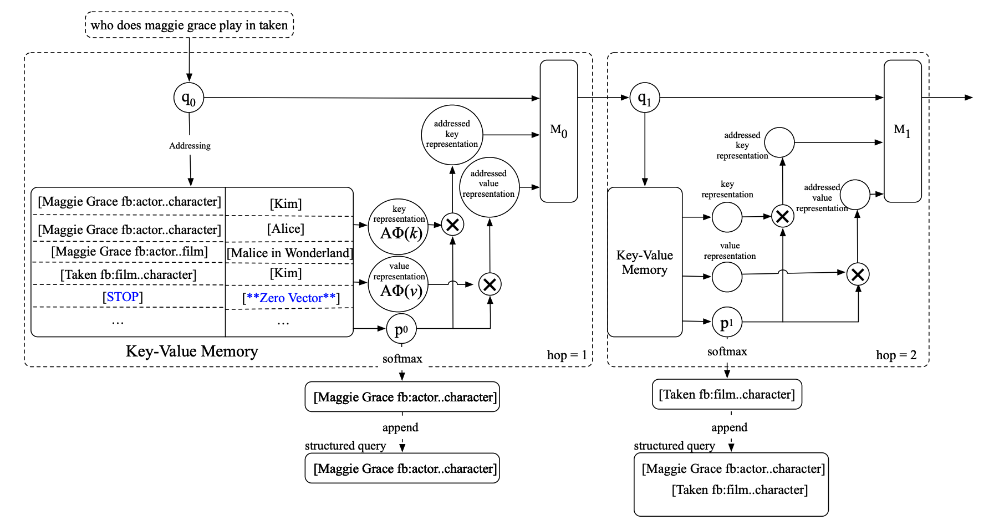

#### 1.Key Hashing（STOP告诉我们的模型我们已经积累了足够的facts去回答问题了）-筛选
这里所做的工作就是根据KB和question中的word进行筛选。然后就是所有的entity linking和过滤他们的关系have more than 100 objects。
然后为了避免模型有重复的或者invalid memory reading。我们就是引入了一个special key，叫做STOP into the memory for all questions。
STOP: special symbol represented by all-zero vector.
STOPkey就是为了告诉我们的模型我们已经积累了足够的facts去回答问题了，而不需要后续find other facts@后面的hop啦。

#### 2.Key Addressing 和 Value Reading
第一个首先就是匹配工作，主要做的事情就是找到对于一个给定的query最合适的key。这里的工作和往常比较接近。我们做的事情主要就是BoW 来表示vector们～

#### 3.Query Updating
##### 这里既是指出传统的MemNN就是直接sum一下initial query和对应的output，然后就是一个linear transformation。@@这种比较适合传统的RC任务，因为RC的question比较简单。

可是Open domain KB-QA tasks一般是更加复杂，使用multiple relations或者constraints来。

这里的question的方式就是说我们想要mask previously-addressed keys from the query could benefit latter inference.这样的话模型就有能力去专注于next hop。

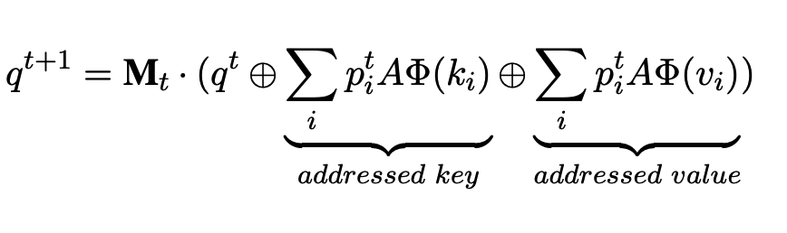

#### 3.4 Answer Prediction
传统的套路就是使用最后的value和answer之间计算相似度。
这里会有一些问题
```
1.许多问题in the open domain KB-QA have multiple answers, 但是KV-MemNN只是选择其中最相似的作为最后的答案。
2.最后一步获得的答案并不一定能够准确包含所有的答案信息。尤其是那种比较复杂的questions，比如multi-constraints或者说multi-relation。那么就是需要考虑每一个hop生成的信息才可以回答最终的答案。
```
那么这里就是将每个o和上一个o加起来作为最后的m。

#### 这里获取答案总共包括两个手段
1.AR:
	就是用最后的输出m（加上以前的啦）和所有的答案进行一个匹配，然后输出概率最大的answer。
2.SQ:
	这个就是收集所有的best matched keys at every hop 去创建一个Structured Query，然后execute it over the KB 去获取所有的答案。然后直到key变成STOP key为止。

关于SQ需要注意的事情是我们并没有一个gold-standard 的SQ，所以我们训练阶段和测试阶段采取了不同的策略。

然后这里就是训练使用AR，然后测试就是使用SQ。（结果上说明我们是**第一个**使用了IR+semantic parsing fashions的）

#### 重点是实验结果分析
1.SQ比AR的效果高了6.（但是必须拥有STOP这个机制，不然效果没有传统的AR好）


2.实验结果证明我们的query updating虽然粗糙，但是表现还是比之前的好。

## 7.Dynamic Memory Network@2015NLP，当时效果超过了非End-to-end的MemNN@bAbI dataset（一个slot的dynamic memory：GRU，是产生一个总的好的fact的表达来更新memory，只不过这次memory不再是slot，当然计算需要更新的context也不再是attn sum，而是modified GRU--所以是动态的。）
Motivation:(sequence tagging/classification/Seq2Seq/QA
1.这里主要就是之前的embedding都是BoW那种，我们用GRU来搞所有的Module。

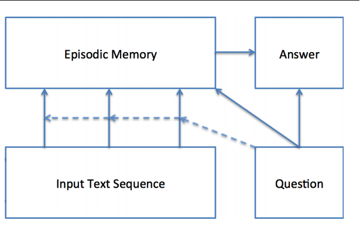

首先强调一下Episodic Memory本质上就是选择输入中真正需要关注的部分@Attention，然后就会产生对应的memory vector～然后每一步迭代中都可以产生前一步迭代中没有捕获的新信息。

### Input Module（一堆句子向量或者一堆word向量）
这是将所有的文本借助GRU来表示。（如果是一个句子，那么就是句长个向量表示，然后就是Attention来选择与Question最相关的单词）
一堆句子，就是每一个句子，然后用end-of-sentence输出就行。
### QUestion也是固定的
### Episodic Memory Module（此时只有一个slot）
#### 总结: 核心就是比如说每一个句子都会和q和上一个m做一下交互，得到当前的memory。（与q相似的会保留更新当前的memory）stop对于有监督的就是加上了STOP符号，没有的就是限制iteration steps
这里就是一个iteration的过程，这里就是由一个注意力机制+一个RNN来更新memory。输入是attention-->(输入，question以及上一个memory)
刚开始使用question来作为hidden state的初始化。

这里attention机制来计算q和输入，m和输入的相似性作为gate机制。

然后更新公式就是这个相似性乘当前更新的GRU（输入，上一个memory）+剩余的前一个memory。

### Answer Module@固定的输入
这里就是将memory模块最后的输出向量和问题连接在一起来predict
也是GRU/@这个根据任务来决定。

但是这种纯DMN的attention还是需要监督。（而且那种特征向量表示方法很牵强）

### 上面关于监督的说法是错误的（我自己总结的是错误的，其实事实上如果是DMN，那么就是需要所有的fact都是与问题相关的）

## 8.改进Attention机制@DMN+@VQA/TextQA@2016 Mar(挑战的是input机制和memory机制fact不一定每个都相关的事情)
### Motivation：

1.DMN虽然在当时取得了SOTA，但是事实上并不一定在没有监督STOP的上面取得好的效果。

2.DMN不可以直接回答VQA。

### 改进的方法！！@core

1.一个新的input module@2-level encoder，直接的都是embedding，再加上bigru来搞一个双向的。

2.对于memory，我们使用一个修改的GRU。

### 1.Input Fusion Layer@TextQA
普通的GRU的劣势就是只有单向信息，而且远距离捕捉的不好。sentence reader就是position encoding+word embedding搞定的句子表达。然后就是一个双向GRU来编码上下文信息。

### 1.1. Input Module for VQA
这个就是2D CNN的patch经过bigru。

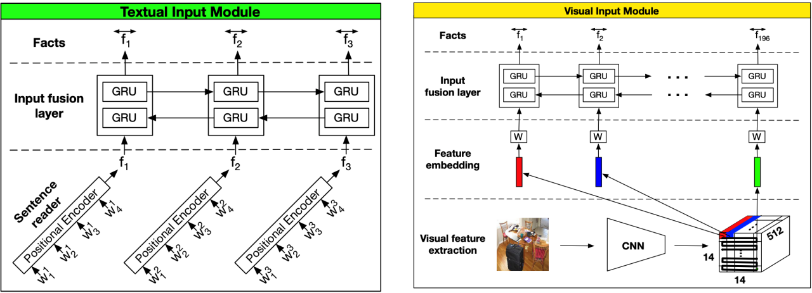

### 2.The Episodic Memory Module
我们这里提出了一种类似attention的机制，然后考虑两条路线:

1.就是简单的attention，但是这样就会缺乏顺序信息。虽然多次attn，某种程度上是一种信息补充。

2.我们这里使用的是Attention-based GRU:
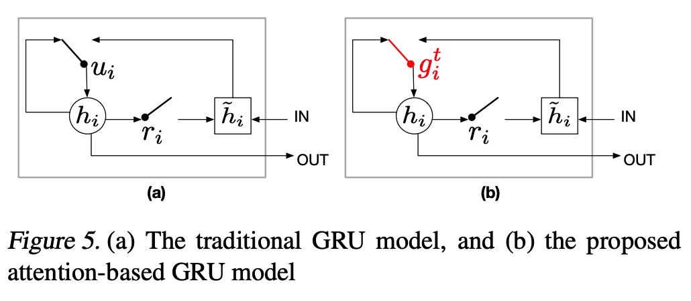

这里就是我们将GRU的update gate改成之前算出来的attn gate，就是当前fact的重要性。
公式就是改成
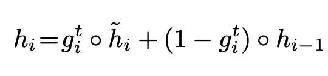

然后为了最后的更新我们这里就是使用最后一个隐藏层的hidden state。

### 3.Episode Memory Updates
两种策略

1.tied model:
这里就是使用一个update机制在每步迭代中都一样，输入就是之前的memory输出c和上一个memorym。GRU。

2.untied model:（这种效果更好，实验结果提高了0.5%。
这里就是结合了query的untied model，非线性层。

## 9.A read-write memory network for movie story understanding(RWMN) 2017 ICCV
### Motivation:

1.对于时长很长的那种Movie我们可以建造一个记忆神经网络；

2.相应的这种记忆神经网络也可以是多模态的。

3.现有的memory网络都把每个memory slot当作是一个独立的模块；但是相邻的模块有很强的关联@@sequential story。（这个想法也来自于human理解story的方式: 整个故事可以被当作是a sequence of 紧密相连的abstract events）

### 个人发现的这篇文章的缺陷。
1.缺乏motion analysis；
2.缺乏动态的memory update。
3.缺乏关系建模。
4.整个read network参数很多？
5.question-related memory这种融合得到的cell真的有效吗？（多模态融合）

### 我们的Contribution

1.RWMN: 就是可以灵活地read+write 抽象信息-> memory slots.@@@第一个尝试使用多层卷积神经网络去read/write的。

2.在当时MovieQA benchmark上取得了SOTA。

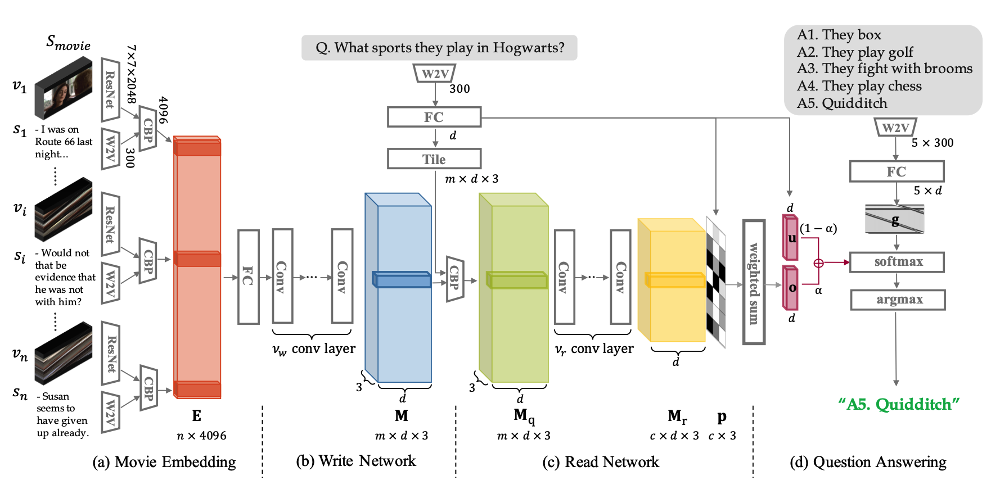

### 1.Movie Embedding(视频都是2h这种的，所以就是会有很多的video subshot)

1.这里关于subshot就是resnet+meanpooling-》得到对应的shot的visual feature。（每个视频输入有多个shot）

2.然后每个sentence我们都用w2v+mean-pool(position encoding)

3.然后对于每个pair（shot，sentence），我们使用CBP进行embedding。

### 2.Write Network（motivation来自人们不是简单理解为一个视觉内容的序列，而是多个邻接的相互关联的slot）
这里就是我们使用了Movie Embedding Matrix作为输入，然后生成memory tensor。
```
然后使用CNN来学习memory之间的关联。
```

### 3.read network

#### 3.1. 首先是关于每一个memory slot对于不同的question应该起到不同的作用
所以我们这里就是使用了一个question-related memory embedding。
这里就是CBP(memory, q)

#### 3.2. Convolutional memory read
这里也是使用CNN来实践这个network。（为了回答问题我们有必要将所有的scene连接在一起）

### 4.Answer Selection
这里我们做的工作就是question-guided weighted sum@memory cell。然后用memory和question 和在一起来回答分类问题。

### 实验结果分析
1.这里就是read和write的消融实验证明。我们其实针对生成的所有的memory pair，我们应该采用CNN来进一步提取高级的抽象语义信息，效果会更好

2.question-related memory这种融合方式对于单纯的memory是有意义的。


## 9.2017 MM: Video Question Answering via Gradually Refined Attention over Appearance and Motion(Attention Memory Unit)
这篇文章说仅仅appearance和motion就足够了，但事实上额外的特征比如text或者caption等等高层都是有效的呀，所以我觉得他claim有问题。

### Motivation:
1.目前的工作缺乏对appearance和motion的同步分析；

2.question直接仅仅表示成一个feature缺乏analysis，只是coarse-grained feature。

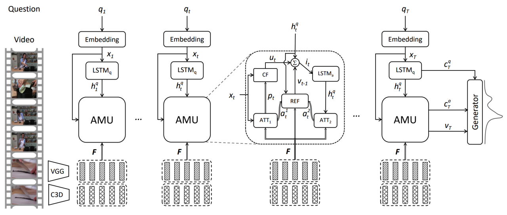

### 1.Feature Extraction
和大部分工作一样，2D/3D/w2v。

### 2.Attention Memory Unit
这里就是two-channel的套路。

```
四个重要的组成模块:比如Attention(ATT), Channel Fusion(CF), Memory(LSTMs), Refine(REF).
```
#### Attention：

1.这里就是针对每个textual word，我们都计算一下与visual feature之间的相似性，然后利用这个相似性对visual feature进行weighted sum。然后我们就是得到了对应每个word的appearance feature和motion feature。

#### Channel Fusion

然后就是根据当前的word表达来做一个attn来融合appear和motion。

#### Memory

## 9.MAC cell@一个tradeoff between 深度学习的方法和symbolic方法@ICLR2018

### Motivation:仿真一个真实的推理单元

1.深度学习的方法缺乏解释性，阻碍他们表现explicit and sound inference procedure。

2.因此就有人提出symbolic，但是这样的方法实在太脆弱了。

3.MAC cell的想法就是模仿一个inner working of an 推理step@idea来自计算机架构。


### 技术核心
MAC Network就是一个e2e的可微分的架构perform an explicit multi-step reasoning process，by stringing together p recurrent MAC cells@每个都是为了一个推理步骤而服务的。

### 1. The input unit
1）question: word embedding+BiLSTM,然后每个step我们都是使用之前的final hidden state来做一个linear transformation得到当前step的question表达。
2）image: 这里就是resnet，得到的feature是14x14xd的image feature。

### 2. The MAC cell
这里就是有两个hidden states，比如control和memory of dimension d。

#### 关于Control（获得是ci）I表示step（也是attn）

```
这里就是让我们focus于question中的不同部分的单词。
这里的方法就是使用之前的question表达和当前LSTM那里的q表达（这个就是使得cell可以base its decision for the ith reasoning operation on the previous operation）来softmax每个单词的重要性。就是用相似性计算q和每个word。
```

#### 关于Read（获得是ri）这个就是图像中需要的信息r@为了表现当前的ci的任务的


1.这里就是计算knowledge-base element（多个）和memory之间的relevance。允许模型去表演transitive reasoning by 考虑上一步获取的重要信息。

2.然后就是linear（KB，1得到的结果）这里就是更新的facts。

3.然后就是用当前的facts来和ci进行交互，做一个weighted sum

#### 关于Write Unit（存在memory state里面）（这里就是输入之前检索的信息ri以及上一步的memorymi-1还有guide by 当前的ci）


这里的第一步是强制的，别的都是optional的。（实验结果证明加起来效果一定更好）
1）首先就是linear(上一步的memory，当前的retrieved information）
2）可选择性的self-attention。这里就是计算了每一步的control unit的相似性然后用这个softmax来加权每一步的memory来combine当前的memory（这个有些接近KV-MemNN）
3）Memory Gate可选：这里就是有些问题比较短可能不需要那么多迭代，因此我引入一个gate来表示是否需要当前的学习记忆2guide by ci。

## 关于output unit直接concatenate memory和question来回答最终的答案。


## key: 关于消融实验
1.Question Attention：实验结果验证使用这样的attention-based control state而不是完整的question表达会drop 18.5%的acc。（这说明control state很重要）所以证明对于长的question这种操作很是很有必要。

2.Network Length: 这个p=8的时候取得了最后的结果，这个就证明了咱们的multi-hop architecture更适合多步推理，而不是那种之前的2-3就结束的架构。

3.weight sharing：这里就是使用weight sharing的策略也是非常优秀（甚至取得了更好的结果）

4.Control Unit

5.Write Unit：这里就是发现两种optional效果都很好，那么很可能就是更加适合longer或者更加complex reasoning process over KB。

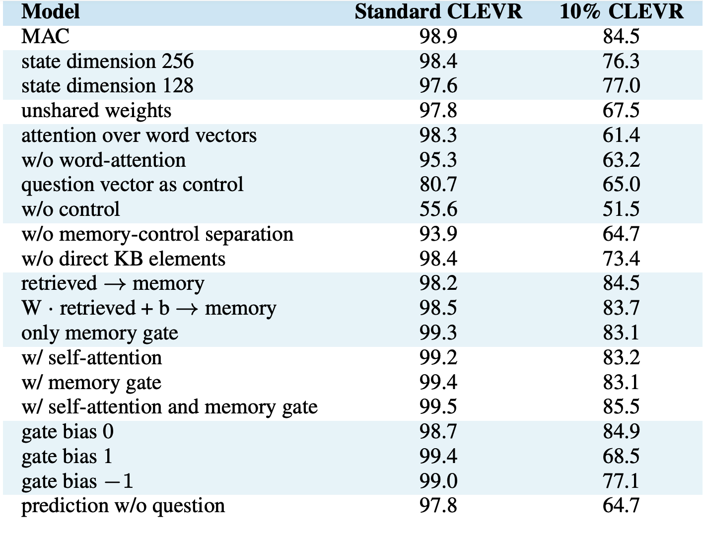

6.这里的gate机制有关的使用更有意义。就是memory gate。这里就是使用-1模型就更容易保留之前的memory，然后1就是更有可能使用新的memory。1很适合full dataset，然后0对于有限的数据就是比较ideal的。这就证明数据足够多，那么MAC就很适合利用学习的能力@新的memory。

## 9.Learning by Abstraction: The Neural State Machine@TODO
### Motivation:
1.这里就是集成neural和symbolic的能力来服务visual reasoning task。

### 方法（两阶段: modeling and inference)
1.就是首先搞成scene graph来表示semantic knowledge in a compact form。node表示的是objects，然后边就是他们的spatial and semantic relations。

2.我们将graph看作是state machine，然后仿真一个iterative computation over it。

3.


## 9.Co-memory@VideoQA 2018CVPR
四种module:
Fact/episodic memory/question/answer. 

需要通过q和上一个memory来read facts产生对应的可以更新的context vector来更新memory。

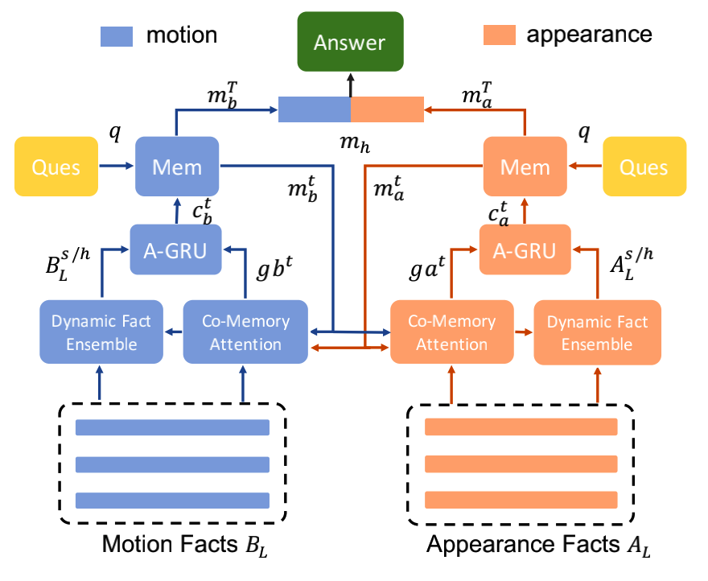

## 综合评价

这里的工作很粗糙。read the fact to update the memory。

1.这里的两者之间appear和motion基本是相互独立对待的。只有在提供那个表达不是那么明确的attn的时候有点意义。而且此时fact也没有做多模态融合？而且query也很粗糙只是一个表达。

2.multi-level facts还是有意义的，核心在于不同的cycle可能需要不同级别的信息。

### Motivation:

1.Appearance and Motion information are both involved in the reasoning process;

2.不同的question需要不同的frames来回答问题。

### 提出的技术

1.two-stream model-》temporal convolutional and deconvolutional nn: multi-level contextual facts;（这个就是same temporal resolution但是代表不同的contextual information）@input facts

2.co-memory network就是两个分开的memory state，一个是motion，一个是appearance。

3.基于这种复杂的memory机制，我们提出一种dynamic fact ensemble。@产生temporal facts。（来更新对应的memory，当然更新方法直接MLP）


 
## 10.Memory-Attended Recurrent Network for Video Captioning@CVPR 2019

Motivation:

1.现有的Caption工作大多都是encoder-decoder这种framework+attention，那么每生成一个word，我们只能获取一个source video的信息；那么有可能会生成不是那么准确的caption；

2.那么我可以在生成每个word的时候联系所有的与之相关的visual contexts。

3.就是对每个word都有一个专属的memory。然后memory-based decoder就可以被当作是一个assistant decoder。

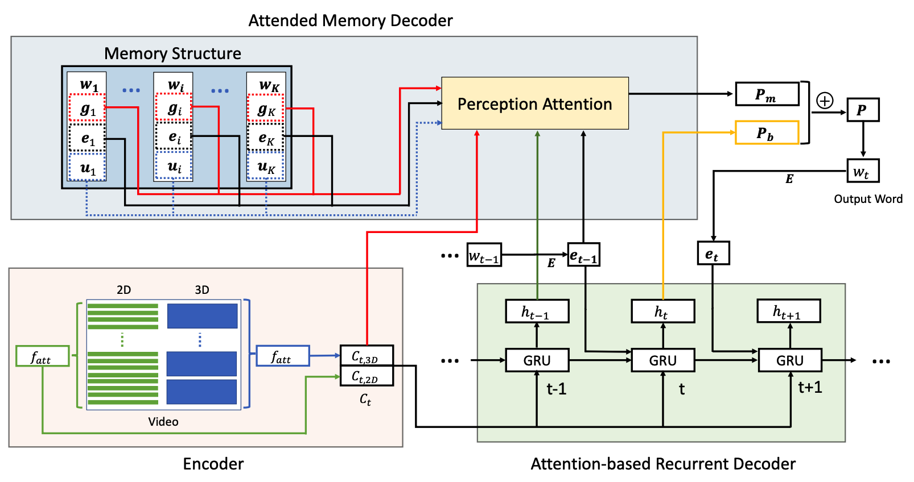

### 1.关于刚开始的visual feature encoder的思路。
这里就是抽取2D/3D，然后project到同一个space。

### 2.Attention-based Recurrent Decoder
```
1.Attention-based GRU，对于visual的外观和动作特征分享所有的注意力@一种正则化。

2.我们这么做-在decoder fuse，而不是直接concate这个feature-encoder，这个的话visual feature就不会inter-pollute了。
```

### 3.Attended Memory Decoder

#### 3.1 Memory Structure
这个就是mapping结构，vocab中的<w,d>。d由三个成分组成:

1. Visual context information.

对于每个word，我们用attn提取每个video的top-k相关的feature。（直接进行sum）

为了避免重复建模，我们训练完之前的decoder之后，再用同样的attn来搞这个。

2. Word embedding.
然后就是使用之前的word embedding@decoder加进来memory。

3. Auxiliary features.
我们还用视频类别embedding加进来来增加精度。


## 11.HME @ CVPR 2019
### Motivation：

1.Co-memory那种策略会缺乏两者combine在一起的attn，会miss一些信息。那么我们这里就是learn 时空attn同时地。

2.question表达非常复杂，所以我们这里就是重新设计了一个question模块+question memory。

3.新的多模态融合layer。


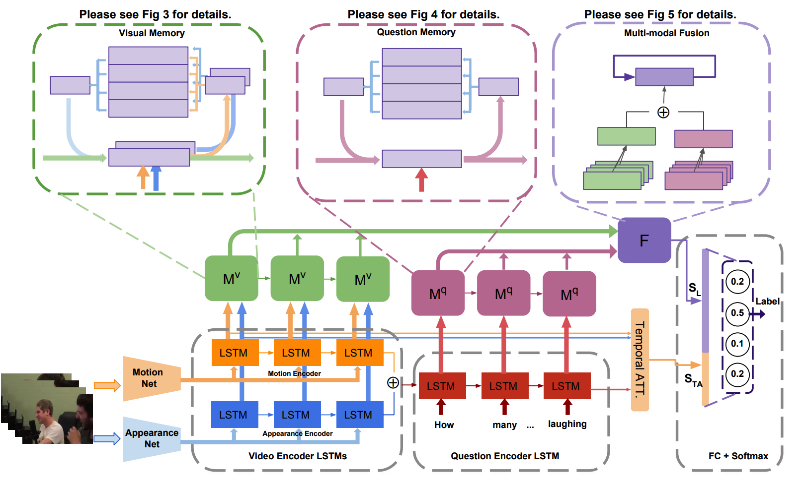

### 1.Video Feature
C3D/ResNet+LSTM得到的每个输出。

### 2.Question
GloVe+LSTM得到的每个输出。

## HME由多个hidden state来主导。

### 3.HME Write(此时又是用上memory slots这个概念了）
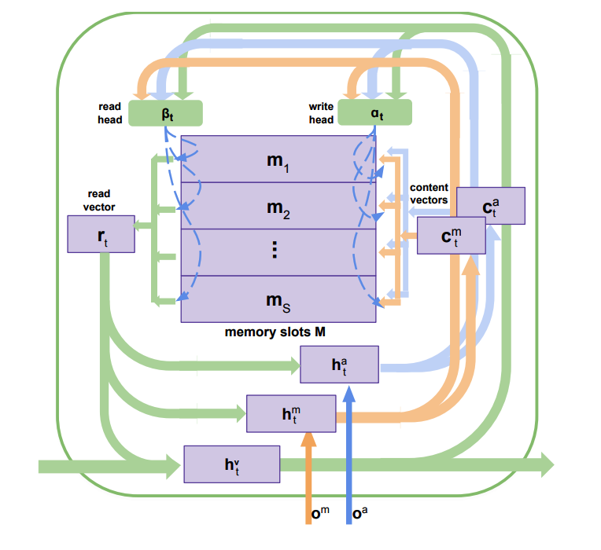

这里就是有多个输入比如encoded motion features和encoded appearance features。然后还有多个write heads来决定到底什么应该写进memory中。

1)h^a决定appearance contents which will be written into memory;

2)h^m决定motion contents which will be written into memory.

这里的memory更新就是attn权衡需要写进apearance的和需要写进motion的以及两者融合在一起的。（就是使用了三个hidden state来衡量的而已）。

个人觉得这里面更新memory筛选的也不是对于question有意义的信息呀。而且融合方法信息损失太多了吧。缺乏关系信息的引入。

### 4.HME Read（个人感觉做的不太好）
Write完当前的memory之后我们要做的事情就是perform an attention read operation来更新对应的hidden state

这里更新方法就是集成了各种类型的信息吧。

### 5.External question memory（改进就是结合了dynamic和memory的策略吧）
现有的深度学习方法对于复杂的问题理解存在很大的问题@challenge，因为他们仅仅是理解问题根据local words。为了解决这样的问题，我们介绍了question memory@context-aware text knowledge。

她们说她们的可以存储序列性的text information，学习words之间的相关性，从一个宏观的角度上去理解问题。


## 12.Working Memory Networks: Augmenting Memory Networks with a Relational Reasoning Module(W-MemNN)

### 1.Motivation:
1.MemNN无法搞定关系推理有关的任务。

2.Relation Network只能搞pairs

### 我们的方法组成
1.input module: 就是内部的向量表达@short-term storage；这里就是input info存在chunks里，然后each chunk is saved into a short-term storage。（这个storage只有在每个hop才有可能access）

2.attention controller: 更新working memory buffer。（这个就是决定到底哪块short-term storage这个模型需要关注）许多都是使用一个compatibility function between memory and the question。然后output就是weighted sum of the memory values，使用注意力机制当作权重。（这里使用加上权重的attn更好，因为这样我们就可allow more complex patterns of attention.

3.reasoning module: 就是用set of objects stored in the working memory buffer(推断memory之间的关系）尤其适合那些需要comparsion的任务。
*****
这种component-based 架构主要就是multi-component working memory model

我们的表现也达到了Module Neural Networks的效果，而没有额外的text processing。

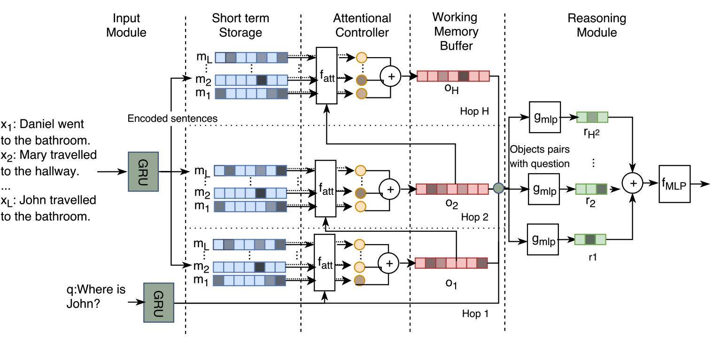


### 1. Input Module
这里就是使用wordembed+GRU来进行编码。然后每个memory chunk都是sentence有关的embedding～

### 2. Attentional Controller
这里就是计算相似性不过是用了multihead来搞slot之间的相似性而已。

### 3.reasoning Module@
这里就是使用关系网络来将每一个hop的结果成pair，然后就是concatenate question vector来作为最后的output。然后sum。


## 13。2019 May @ Bidirectional Attentive Memory Networks for Question Answering over
Knowledge Bases@@@TODO

### KBQA存在的困难:
1.相同的问题可以表示成各种各样的方式Z@NL(Natural Language)，而KB经常会有canonical lexicon。简洁的表达

2.搞定KBQA的方法一般可以划分为两类:
	1.semantic parsing(SP): 这里做的工作就是创建一个semantic parser来将NL questions转化为中间的logic forms，然后就是可以通过KB来执行。
		1）传统的semantic parser需要注释的logical forms as supervision。那么在logical predicate上面的使用就是narrow domain。近期的方法都是经过手工的来搞定的。
	
	2.information Retrieval(IR): 不像SP-based方法，他们假设a predefined set of lexical triggers or rules，限制了他们的domain和scalability。IR的方法一般是从KB中检索答案借助questions。
		1）并不需要手工的rule，所以在大的以及复杂的KB上有较好的泛化性能。

### Motivation:
1.KB对于理解问题是很有意义的，问题也可以帮助我们来关注重要的KB aspects。因此，我们就设计两层的bidirectional attention network。
	primary attention network就是关注question中重要的部分借助KB。	以及KB中重要的部分借助question。
	secondary attention network就是增进增进question和KB表达通过额外探索two-way attention。

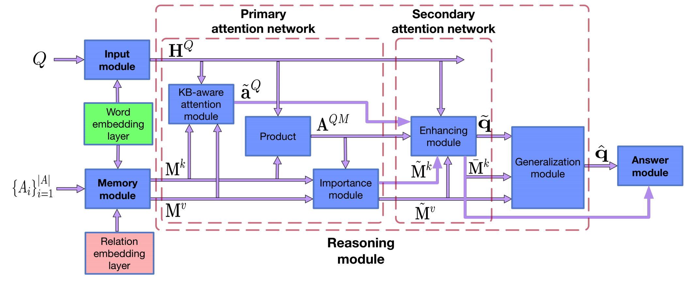

### question就是GloVe+bilstm。

### memory module

#### 1.candidate generation


#### 2. 


## 14.CVPR 2017: Attend to you: Personalized Image Captioning with Context Sequence Memory Networks

### 这个任务的本质就是针对不同的人@prior knowledge，我们给图像产生不同的生成式描述。
这种任务一般是在不同的automation services中有使用。

### Motivation:
这种个性化image caption包括的任务，比如hashtag prediction和post generation。
1.hashtag prediction就是预测a list of hashtags for the image；

2.post generation就是创建一个sentence@由几个normal words组成emojis和even hashtags。

这个任务很难的，因为这个不只是简单的图片描述，而是user的自己的故事和经验about the image。

我们的工作@memory
1.这里就是一个context repository的prior knowledge，我们必须学会利用prior knowledge about the authors。那么我们就是想办法更佳focused prediction。

2.CNN memory structure去jointly represent nearby ordered memory slots。


## 15.Progressive Attention Memory Network for Movie Story Question Answering
### Motivation:
1.比起之前的memory 工作@MovieQA，我们的工作是支持多步迭代推理的。

2.


### 我们的技术针对的点:
1.progressive attention mechanism: 使用question和answer的信息来逐步过滤掉无关的temporal parts in memory；

2.dynamic modality fusion: 自适应决定每个模态的贡献；

3.belief correction answering: 连续地改正针对candidate answer的scores～

### 1.Dual Memory Embedding
关于video的表达我们就是注意到我们可以生成两种memory表达，一种是video的一种是subtitle的。为了反映这两者是有比较强烈的关联的，我们就是使用average pooling来将adjacent 表达into a single memory slot。
（这里就是类似之前说的工作一样，加上FFN）。

这里主要就是在每步更新的我们都用attn+softmax来对每个memory‘搞一次，再linear map一下。

## 16.Multi-step Reasoning via Recurrent Dual Attention for Visual Dialog
### Motivation
1.现有的工作single-step的

2.后期的attention@关于有用的信息应该更佳narrow down the regions most relevant to the answer。


## 17.REM-Net: Recursive Erasure Memory Network for Commonsense Evidence Refinement
### Motivation:
1.虽然现在已经有很多关于检索常识的工作了，但是事实上还是很大的机会去改进这个evidence的质量。
那我们就是提出一个不断迭代删除低质量evidence的网络框架。

而且我们也不是用刚开始的KB，而是用一个预训练的模型来针对当前question生成知识。

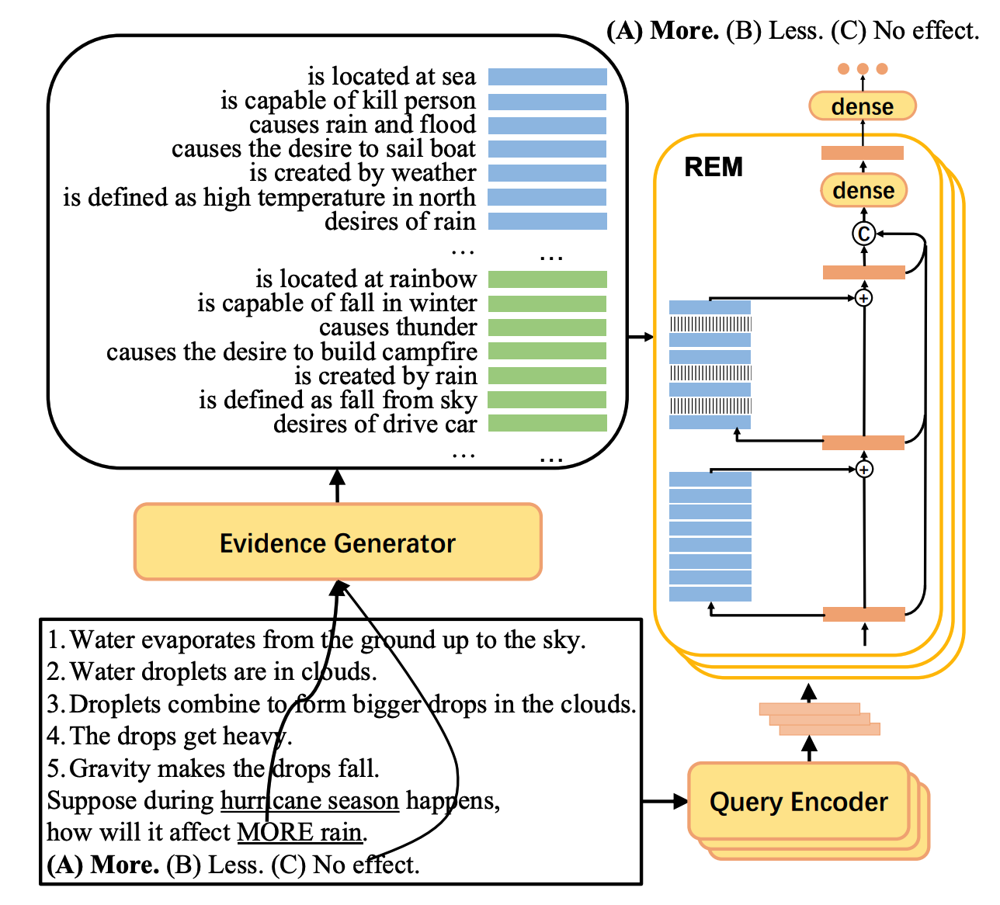

### 关于真实的记忆删除模块
我们的网络设计十分接近于MeMNN都是迭代匹配来筛选重要的信息。

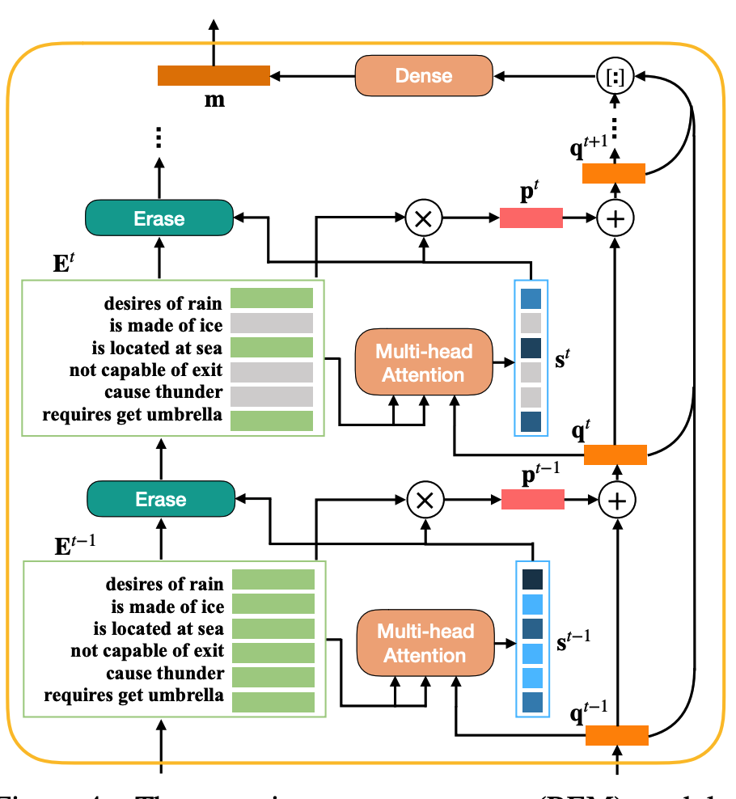

这里的就是使用Multi-head attn来进行筛选有意义的vector之后，再使用其和当前的query vector进行sum得到最新的query vector。

与此同时分数较低的evidence matrix中的supporting facts就会被删除。


最后的回答就是所有的query concatenate在一起之后进行softmax预测～

### 个人总结@AAAI2021
他不就是多了一个按照attn score删除的机制嘛。


## 18.ACL2020@Multimodal Neural Graph Memory Networks
for Visual Question Answering
### 1.Motivation:

1)这篇文章关于如果引入图，就是假定一个memory架构@external memory

2)这里就是caption搞定的事是object attribute+关系。

### 2.我们的技术
这里的spatial memory就是outputs of GNs，state of GN nodes可以被看作是internal memory，然后state of spatial memory可以被看成是external memory。

我们的node都是使用region+q的MCB来进行初始化的。当然这个graph network还包括了一个global的attribute就是使用global vector来进行初始化的，这里就是为了帮助那些需要用这个来回答问题的。

### 3.我们的更新
我们首先更新GN，然后更新对应的memory cell。


## 19.Long-Term Video Question Answering via Multimodal Hierarchical Memory Attentive Networks（多模态层次化记忆注意网络-两个子记忆神经模块）
### 1.Motivation:
1.人类并不是将其认知为图像序列，而是首先定位重要的moment，然后就是在这个moment周围去收集specific evidence。

2.top-guided memorynetwork就是抽取question中最有意义的片段以及定位显著的video content at a 粗略的level。

3.bottom enhanced memory就是in-depth的推理引擎从一个finegrained的level来增加问题的能力。

### videoQA和long-term videoQA的区别@挑战

1.VideoQA仅仅是coarse interactions of多模态instances和缺乏深度的层次化分解@复杂的视频semantics。

2.long-term的挑战@3点:
	1) 非常长的序列输入，那么如何处理/表达/存储就是一个挑战。

	2) 长的视频包含了很多的噪声以及少量的有意义的信息；

	3) 长视频包含了变化的场景，需要一个更佳全面的推理机制来perform attn。

```
所以我们这种两阶段的就很有意义,首先shallow去除一些没用的信息，那么这里就是一个inter-frame temporal direction和intra-frame spatial direction
```


## 1.Task-Oriented Conversation Generation Using Heterogeneous Memory Networks
### 2. Motivation:
1.就是将
## 1.Task-Oriented Conversation Generation Using Heterogeneous Memory Networ

# 20.Co-memory VideoQA@CVPR 2019
这里就是考虑到外观信息和动作信息在进行注意力计算的时候应该相互提供线索。

# 20.Holistic Multi-Modal Memory Network for Movie Question Answering
## 1.Motivation:
1.一个核心的挑战就是必须集成不同的data sources来回答问题，但事实上early fusion和late fusion都有它们各自的弱点，比如early-fusion就是pick up meaningful semantic correlations 因为特征级别上增加的噪声～而late fusion就是does not allow cross-referring相互参照 between modalities to 定义更高级别的语义特征～
**这里就是说前人的工作仅仅只是consider a subset of interactions between the question，videos，subtitles for context retrieval**

3.而很多工作并没有利用到这个answer choices的信息～

## 我们工作的核心思考HMMN
1.我们的框架就是使用了both inter-modal and query-to-context注意力机制4 有效的数据集成@each hop～（这里就是我们的attention是整体考虑的，而不是仅仅是subset）

2.就是我们在检索过程的attention也是answer-aware的，我们用到了context部分的信息。

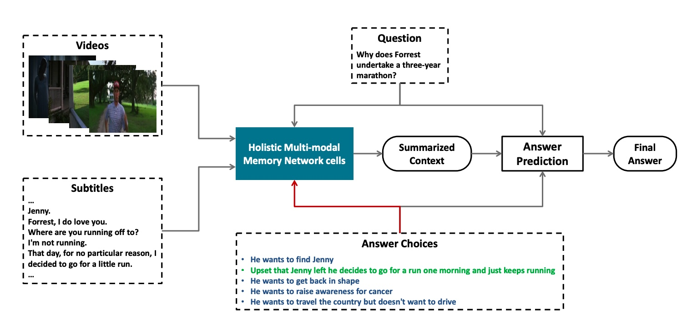

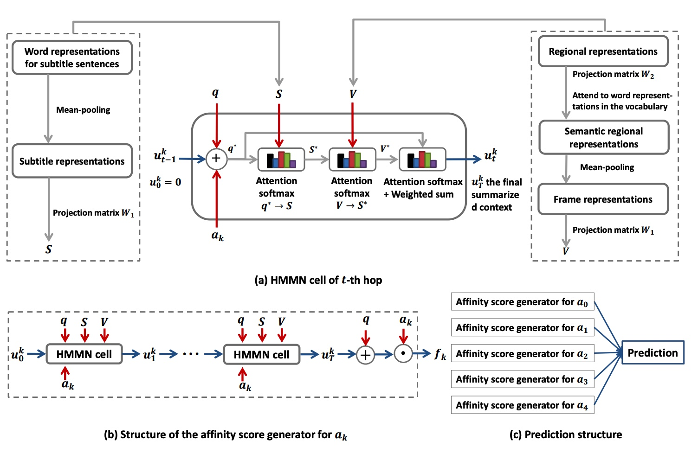

## HMNN cell
1.就是每个HMMN cell都接受问题和视频以及字幕的contexts->answer-aware summarized context.
这里的整体就是计算一个visual-aware subtitle，然后attn而已，说实在的就是subtitle比visual更meaningful而已。

# 21.A Co-Memory Network for Multimodal Sentiment Analysis
很多目前的工作只是image和text separately来进行处理，然后最后再combine在一起搞分类。
## 1.Motivation:
1.前人的工作都是分开处理的，而没有考虑到两者之间的mutual influence，比如它们可以是mutually reinforce以及complement each other的。

我们的想法就是提出一个创新的co-memory network去迭代建模interactions between visual contents以及textual words@@@多模态情感分析。

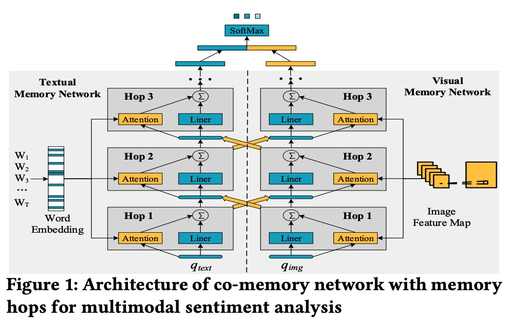

## 2.1 Feature Extraction
1.首先关于图像，我们都知道图像对于情感分析而言还是比较有意义的，比如说我们的图像是关于love sign/rose/wedding的，那么可能就更加接近positive sentiment。然后vice versa。而且人们在看图像的时候并不是所有的部分都是有意义的，因此我们就是仅仅专注于感兴趣的部分。@@visual memory network去关注图像中重要的部分。

2.这里visual memory就是low-level的conv map中的整个feature map flatten下来对于question进行attention之后，然后weighted sum。

## 总之这里的思想很简单就是attention上面的关系和Co-memory VideoQA的一样～

# 22. Multi-interactive Memory Network for Aspect Based Multimodal Sentiment Analysis
aspect-level就是旨在identify the sentiment polarity of a specific aspect in the context.
## 1.Motivation:
1.我们是第一个去做aspect based multimodal sentiment analysis的，并且提出了一个Multi-Interactive Memory Network

2.核心就是co-attention加上GRU来更新。

# 23.ICON: Interactive Conversational Memory Network for Multimodal Emotion Detection
对话中的情感识别对于build有情感的machine而言是蛮重要的。
## 1.Motivation:

# 24.Concurrence-Aware Long Short-Term Sub-Memories for Person-Person Action Recognition
## 1.Motivation:
1.现在LSTM在建模individual dynamics for single-person action recognition还是很有效的@时序建模。

2.但是现在的RNN仅仅capture temporal dynamics of the perfon-person interactions by naively combining the activity dynamics of individuals通过建模它们as a whole。（这个就忽略了person-person interactions是如何在改变over time 的）

## Novelty（Concurrent并存的）
1.我们这里就是提出一个创新的Concurrence-Aware LSTM(Co-LSTM)去建模long-term inter-related dynamics between two interacting people on bbox covering people.

2.具体上来说，对于每一个frame，两个sub-memory units就是存储了个人的motion信息。

3.然后concurrent LSTM就是选择性集成并且存储了inter-related motion信息作为a new co-memory cell。

