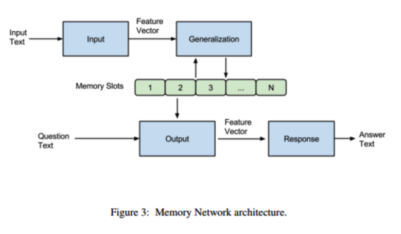
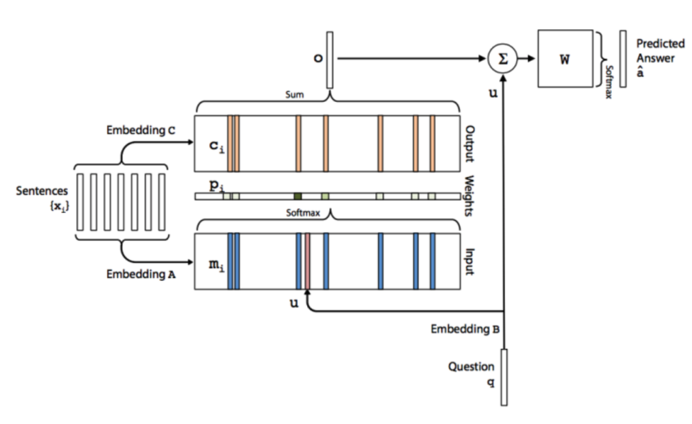
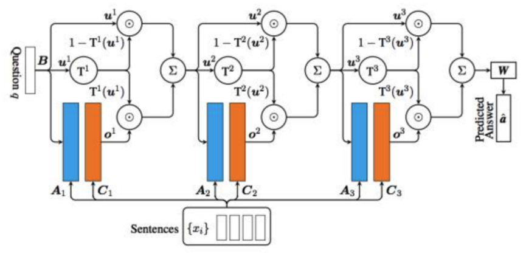
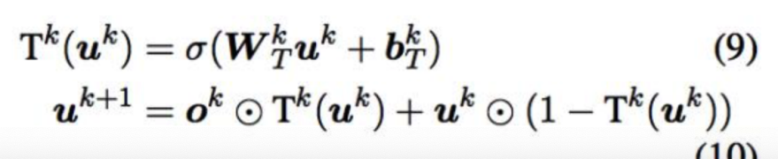
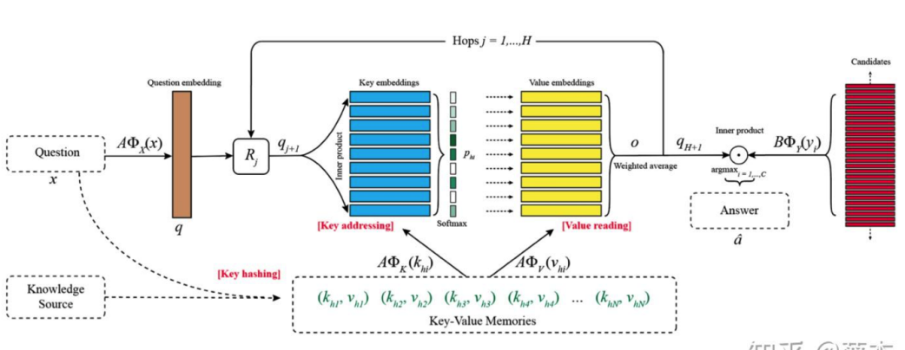

# awesome-MemoryNetwork
记忆神经网络有关的工作

对于记忆神经网络而言，memory slot里面的信息如果对于query是很有用的将会变得很好。
抽取信息的时候如果有两种memory@embedding，那么一个是和query更加相关的，一个是和答案相关的结果会比单纯两个memory效果要更好。

该两个亮点的idea全部来自于KVMemN2N

## 1.最初始的记忆神经网络(非end-to-end)2014FB


IGOR四个模块～
简单来说，就是输入的文本经过Input模块编码成向量，然后将其作为Generalization模块的输入，该模块根据输入的向量对memory进行读写操作，即对记忆进行更新。然后Output模块会根据Question（也会进过Input模块进行编码）对memory的内容进行权重处理，将记忆按照与Question的相关程度进行组合得到输出向量，最终Response模块根据输出向量编码生成一个自然语言的答案出来。
#### 整个流程
```
整个流程是这样的。首先就是input和generalization模块做的工作都很简单，一个是输入encoding+存入记忆。（不进行任何操作）
然后是output和response就是主要 做的事情。output'做的事情就是根据文本匹配任务选择最相似topk的记忆。（这个就是非end-to-end的），然后就是关于最后的response就是和答案做一个相似性计算而已。使用margin ranking loss。
```

## 2.end-to-end memory@2015NIPS（MemN2N）


1.首先是输入模块，这里就是将输入的文本转化成向量并且保存在memory中，本文的方法是将每句话压缩成一个向量@对应memory的一个slot。（每个slot代表一句话）。
  里面的编码方式有sum/位置加权词向量。
  同时为了编码时序信息，我们需要在上面得到slot的基础上再加上矩阵中对应每句话出现的顺序。
2.输出模块：首先就是针对文本有两个embedding矩阵。然后第一个就是拿来和question做一个相似度计算，softmax之后来加权第二个slot的vector得到最终的和question相关的文本向量。最后就是加上question来做一个预测。

#### 多层模型
这里的核心就是多个stack起来。
加起来作为新的question。（原输出）

```
为了减少参数，我们可以采取的策略有2种：
1.Adjacent:这里就是相邻层的A=C。
2.layer-wise:与RNN相似，属于完全共享参数。
```

#### 关于Mem实验结果验证
基本上得出模型的每个hop层都可以学习到问题相关的输入，对于简单问题，三层就够了。呈现一种推理的趋势。
这说明咱们的外部Mem的效果是很好的。

## 3.Gate-MemNN（相当于LSTM对于RNN的improve）-GMemN2N（改进策略非常适合就是说人类multihop机制的方式～上面的会指导下面的）(2016 Oct)
Motivation:
1.在E2E MemN2N在多轮QA/多轮对话/阅读理解/知识推理等效果不好，GMemN2N则是参考Highway Network和Residual Network的改进，引入gate机制来实现记忆的增强。



#### Highway Network的讲解（高速网络）核心也是为了解决训练问题
增加了一个transform gate T和一个carry gate C。

y=H(x).T(x) + x.C(x) (这个点乘是哈德曼积)
这里只是说T和C都是非线性函数。

我们考虑一个更佳简单的版本就是:

y=H(x).T(x) + x.(1-T(x))，这里的T就是gate机制主导的，SIGMOID(wx+b).

#### 残差网络就是一个special case了。

#### 我们这里采取的策略就是



这个就是可以自主选择question的形态了吧@对于下一步的迭代。u是上一层的question，o是当前的输出（文本）。

#### 那么这里最后的结果也是超过MemN2N的。


## 4.KVMemN2N(2016 June)
Motivation:
1.知识库Kb类问题太限制性了。对于开放问答有一点困难，因为我们没办法就是拥有一个通用的知识图谱，而且也很稀疏。



### 改进点
#### 1.Key Hashing
这里就是key-value memories往往来源于Knowledge source,所以说memories的数量会很庞大，但是大部分记忆呢都是和当前query无关的记忆。
所以我们要做的事情是先排除掉那些确保无关的memory set。

这里就是根据query出现的word（首先去掉出现频率次数大于等于1000的stop words）来对knowledge进行筛选。筛选出包含某个word的memory。

#### 2.Key Addressing
这里就是利用Hashing的结果（candidate memories）去和query经过线性变换后的结果计算一个相关概率。softmax。

#### 3.Value Reading
然后就是两个memory啦。就是第二个还是来加权得到对应的o，然后和MemN2N一样的操作进行sum得到对应的query。

#### 然后就是multi-step啦。+softmax啦。

### 核心就是我们如何将KB的memory进行表示呢？（K对应的memory slots应该更加接近question，然后v对应的更加接近value）

1.KB Triple（Key用Subject、V用作object就行-+一个double可以回答更多问题）

subject-relation-object的形式。还可以把知识库做一个double。然后就是embedding呗～（属于K和V）

2.Sentence Level

就是从文本中抽取出kv对，存到memory slots里面。Sentence Level的思想就是把文章分成一句句话，然后每一句话抽取出一个kv对。其中k和v都是用整个句子的BoW来表示，这个方法其实就是MemN2N的用法。

3.Window Level

一篇文章可以划分为多个大小为W的window，将window的方法用于MemN2N也有不错的效果，但是本文中作者使用的是将每个window的BoW表示作为key，每个window的center word作为value，因为每个问题和window内的句子具有更强的关联性。（BoW就是sum word vector啦）（这里有点改变哦）

4.Window + Center Encoding

当于是对上一种方法的扩展，首先把dictionary的大小加倍，通过加倍后的字典重新对key和value进行编码，作者说这样有助于找出中心词与其周围词的相关性。

5.Window+Title

文章的标题通常是和文章相关问题的答案，比如“What did Harrison Ford star in?”可以通过“Blade Runner”这个标题来回答。所以作者在之前Window Level的基础上添加了新的kv对，其中key还是用整个window的BoW，value使用title来表示，使用“_window_” or “_title_”来区分两种不同的kv对。


## 6.Enhancing Key-Value Memory Neural Networks for Knowledge Based Question Answering(NAACL2019)（本质上这个memory是一个IR的问题）
Motivation:
KV-MemNN在开放域的KB-QA上表现并不好，这儿有两个原因。

1.传统的KV-MemNN专注在理解facts in the memory，而不是理解question。而对于question的话尤其是那种multi-relation question，重点是将其分解为一系列的focused queries。
  
### 本文所说的理想的Memorynetwork需要deal with the following challenges:
1)KV-MemNNs经常是read the memory 重复地因为他们不知道什么时候停止。

2)对于multi-relation question的更新方式，传统的KV-MemNNs并不能很好的update the queries～

3)对于解释性QA system的训练的话，需要比较强的注释。这里的意思就是supervision for the memory selection at each hop。

### 我们的贡献
1) a novel query udpating method: decompose complex questions and precisely address a relevant key at each hop~

2）STOP策略during memory readings，这里就是避免重复的Memory Reading。

3）比起semantic parser这种需要很大的labor costs的，我们需要的是弱监督，只需要question-answer pairs～

#### 1.Key Hashing
这里所做的工作就是根据KB和question中的word进行筛选。然后就是所有的entity linking和过滤他们的关系have more than 100 objects。
然后为了避免模型有重复的或者invalid memory reading。我们就是引入了一个special key，叫做STOP into the memory for all questions。
STOP: special symbol represented by all-zero vector.
STOPkey就是为了告诉我们的模型我们已经积累了足够的facts去回答问题了，而不需要后续find other facts@后面的hop啦。

#


