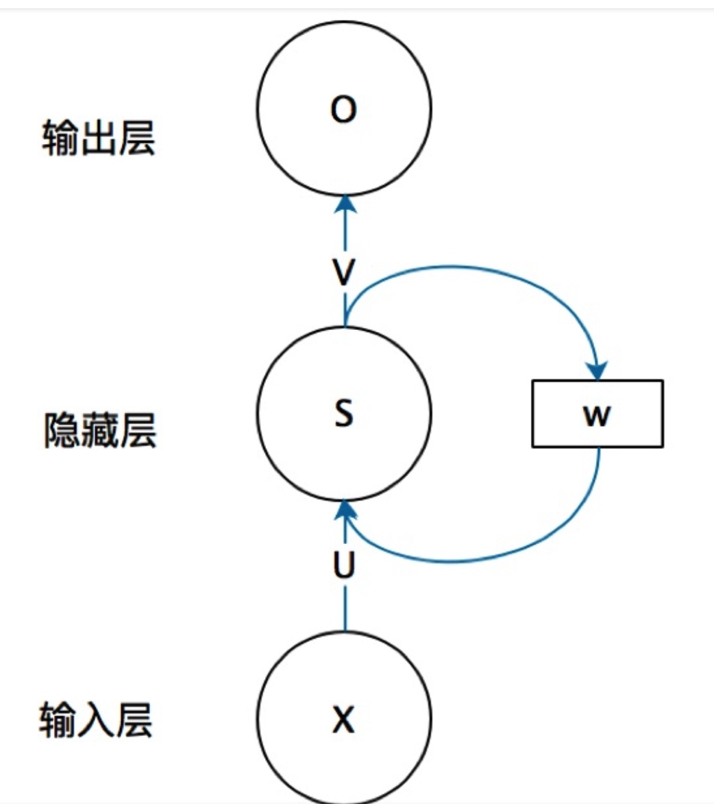
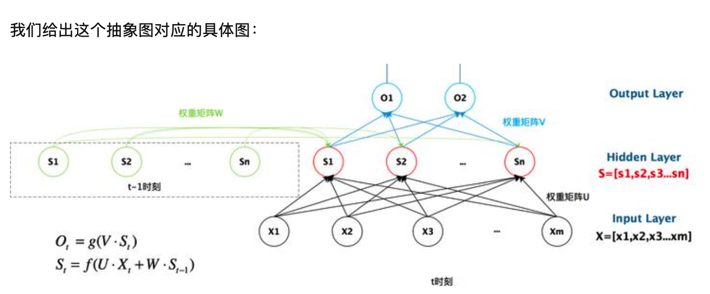
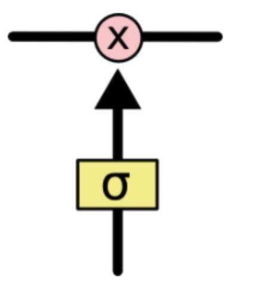
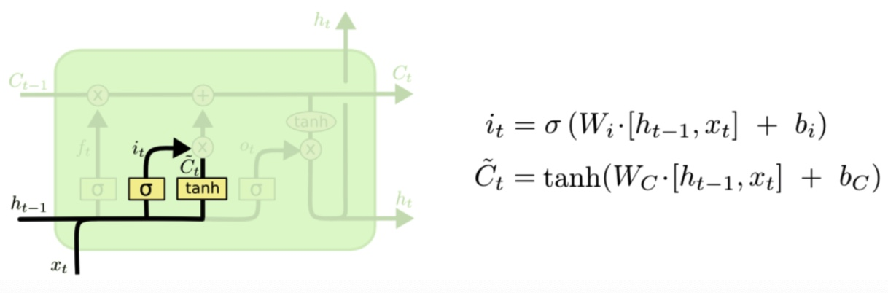
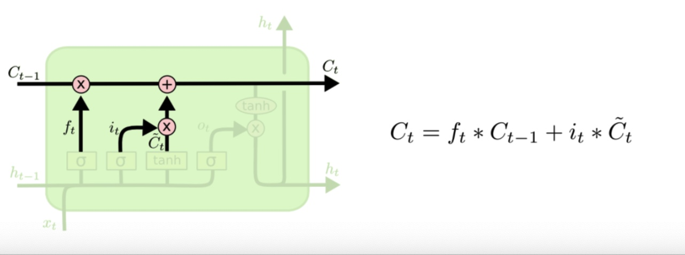
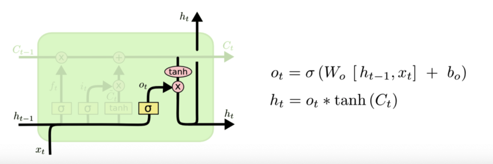
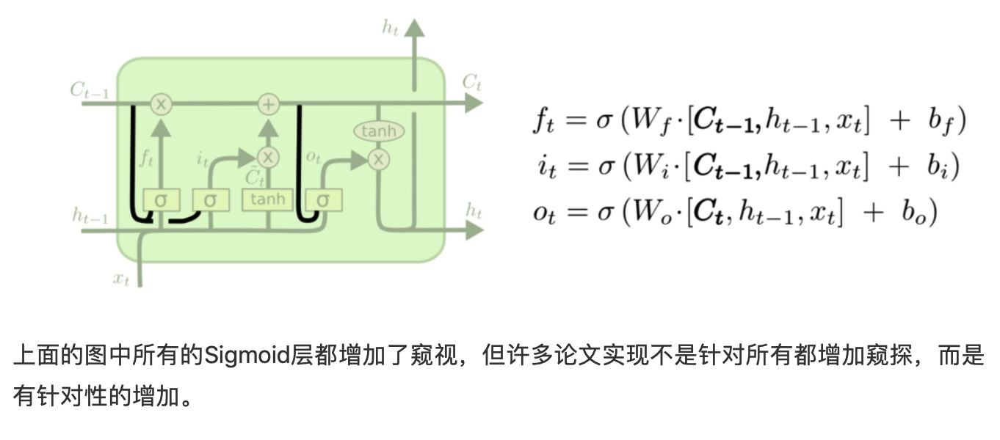
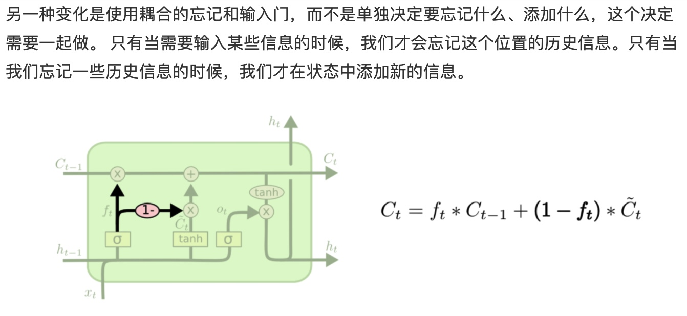
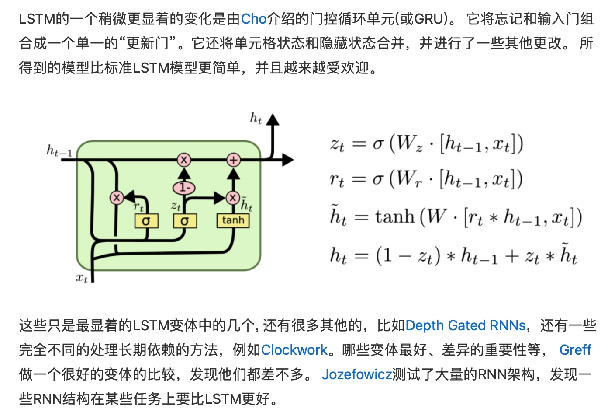

# 人类针对每个问题的思考，一般不会是完全的从头开始思考。正如当你阅读这篇译文的时候，你会根据已经阅读过的内容来对后面的内容进行理解，你不会把之前的东西都丢掉从头进行思考，你对内容的理解是贯穿的。

而传统的NN并没有办法做到利用前面的场景去干预后面的预测～

这里的网络结构就是每一个都传递一个消息给后继者，这里就是传递信息@循环神经网络。

## LSTM提出的背景（4层，三个门）
1.**长依赖存在的问题**
RNN显著的魅力将以前的信息连接到当前任务的这种思路，如果他能够做到这一点，将变得非常有用。但是他足够可以吗？

-在相关信息和需要该信息的距离较近的时候，RNN能够学会去利用历史信息。

-可是事实上也存在很多需要更多上下文的情况。不幸的事是随着距离的增加，RNN无法有效的利用历史信息。

在理论上，RNN绝对有能力处理这样的长依赖问题，人们可以仔细挑选参数来解决这种形式的问题，但是事实上在实践中，RNN似乎无法学习到这些特征。Hochreiter 和 Bengio就深入研究过这个问题，他们发现一些根本性的原因，能解释RNN为什么不work～

但是LSTM没有这种问题。

## RNN Networks（对RNN内部结构进行解析）理解为三层网络
其实这里本质上就是一个hidden layer而已。（输出的时候也经过一个变换哦）所以算是输入一次变换，hidden 再一次变换到输出。

这里就是如果我们把上面的有W的那个带箭头的圈去掉，它就变成了最普通的全连接神经网络。x是一个向量，它表示输入层的value，s就是hidden的value。

这个就是抽象图的具体图，每次都是当前的hidden state由当前的输入和上一步的输出而共同决定～

这个就是按照时间线进行展开～当然这里是包含bias的～

内部的激活函数就是tanh～

## LSTM Networks（虽然我很好奇为什么RNN无法学习到这种非常需要历史的信息的问题）
这里就是使得RNN可以学习长的依赖关系。并被许多人进行了改进和普及。

-*所有的循环神经网络都具有神经网络的重复模块链的形式*

1.标准的RNN结构非常简单。

2.然后就是4层的LSTM啦（stack）

熟悉一下我们将要使用的符号～

## LSTM背后的核心理论
关键: cell state,表示细胞状态的这条线水平的穿过图的顶部。

这里的核心就是一个细胞状态在整个链条上都是运行的，

**LSTM本质就是具有删除或者添加信息到细胞状态的能力，这个能力是由被称为门Gate的结构所赋予的。
Gate就是一种可选地让信息通过的方式，它是由一个sigmoid神经层和一个点乘法运算组成～

*LSTM具有三个门，用于保护和控制细胞的状态*

## 一步步拆解LSTM
### 1.遗忘细胞状态（这里的gate就是自适应学习啦）
forget gate就是sigmoid，由上一个输出（h）和当前输入（x），来决定forget多少上一步的信息。

这个的思想就是我们要是用以前的语料来预测下一个单词。在这样的问题中，细胞状态可能包括当前主题的性别，从而决定使用正确的代词。当我们看到一个新主题的时候，我们要忘记旧主题的性别。

### 2.需要存储细胞
输入门的sigmoid会直接决定我们将更新哪些值，然后下一个tanh层创建候选向量c，该向量会被加到细胞的状态中～

那么这个的本质就是一个self-gating～

### 3.写进细胞状态（遗忘门+输入门的共同作用）

### 4.决定我们到底需要输出什么（过滤版本的细胞状态）output gate
就是输入和上一个输出来共同决定细胞内部输出多少

# 综上可以看出来LSTM的记忆长度和记忆能力都是有限的

## 一些LSTM的变种@peephole connections
2000的peephole connections（就是不管所有的gate层都会允许细胞状态去参与）

但是事实上许多论文实现不是针对所有都增加这个窥探，而是有针对性的增加。

## 变种2@耦合forget 和 input的gate
我们一起决定到底要忘记什么，添加什么（决定必须是combine完成的）。
只有当我们忘记一些历史信息的时候，我们才在状态中添加新的信息。

## 变种3@GRU门控循环单元

当然这里还存在很多其他的工作

## 为什么LSTM需要输出门？
这里的核心思想就是控制着有多少记忆可以用于下一层的更新中。

这里就是“话不能说得太满，满了就难以圆通；调也不能定得太高，高了就难以合声～”这里的输出也得“悠着点”，不能太“任性”的输出，因此还要使用激活函数tanh把记忆值变换一下～将其变换为-1-+1之间的数。

