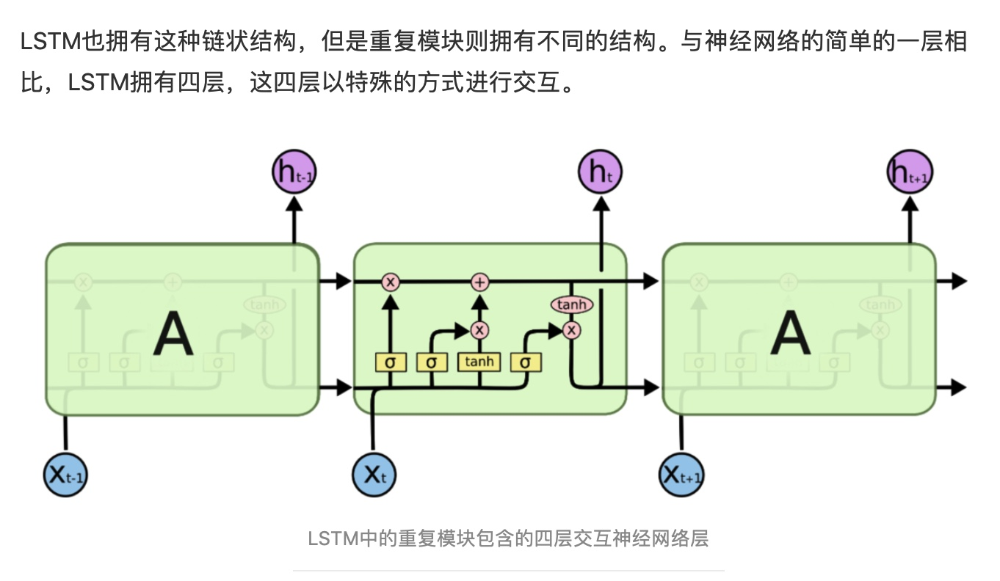

# 人类针对每个问题的思考，一般不会是完全的从头开始思考。正如当你阅读这篇译文的时候，你会根据已经阅读过的内容来对后面的内容进行理解，你不会把之前的东西都丢掉从头进行思考，你对内容的理解是贯穿的。

而传统的NN并没有办法做到利用前面的场景去干预后面的预测～

这里的网络结构就是每一个都传递一个消息给后继者，这里就是传递信息@循环神经网络。

## LSTM提出的背景
1.**长依赖存在的问题**
RNN显著的魅力将以前的信息连接到当前任务的这种思路，如果他能够做到这一点，将变得非常有用。但是他足够可以吗？

-在相关信息和需要该信息的距离较近的时候，RNN能够学会去利用历史信息。

-可是事实上也存在很多需要更多上下文的情况。不幸的事是随着距离的增加，RNN无法有效的利用历史信息。

在理论上，RNN绝对有能力处理这样的长依赖问题，人们可以仔细挑选参数来解决这种形式的问题，但是事实上在实践中，RNN似乎无法学习到这些特征。Hochreiter 和 Bengio就深入研究过这个问题，他们发现一些根本性的原因，能解释RNN为什么不work～

但是LSTM没有这种问题。

## LSTM Networks（虽然我很好奇为什么RNN无法学习到这种非常需要历史的信息的问题）
这里就是使得RNN可以学习长的依赖关系。并被许多人进行了改进和普及。

-*所有的循环神经网络都具有神经网络的重复模块链的形式*

1.标准的RNN结构非常简单。

2.然后就是4层的LSTM啦（stack）

熟悉一下我们将要使用的符号～

## LSTM背后的核心理论
关键: cell state,表示细胞状态的这条线水平的穿过图的顶部。

这里的核心就是一个细胞状态在整个链条上都是运行的，

